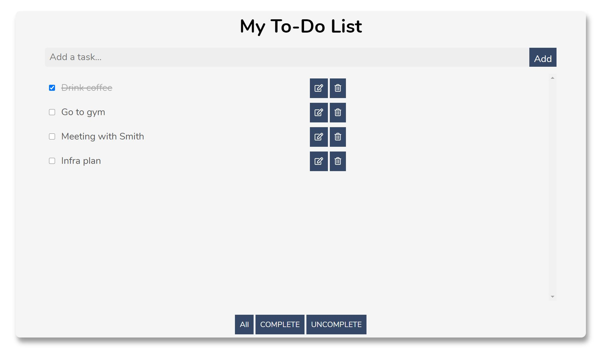

# My To-do list
This is my side project for to-do list

## Feature and how to use it
In this to-do list, you can
* User can add new to-do items to the main section
* User can edit the existing to-do items
* User can check whether the specific item is finished or not
* User can delete a specific item
* User can filter items by the buttons at the bottom of the to-do list

### My technical article
[My to-do list](https://medium.com/@garnett284/side-project-1-to-do-list-36b4dbe8bbc4)
In this article, I shared some key logic and steps for building it. For example, how do I build the add function, delete function, or check function.
